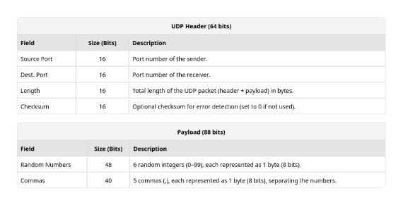
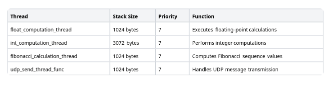
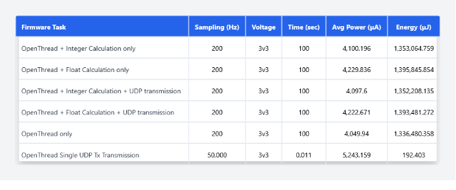
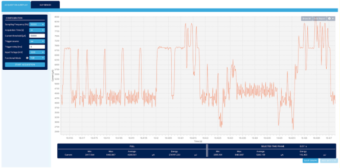
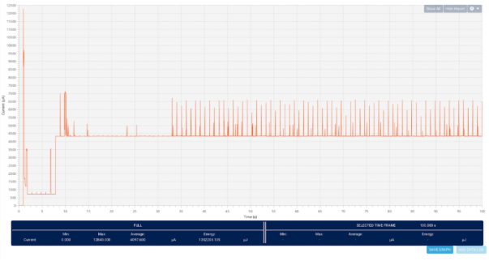
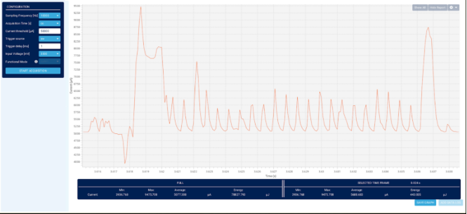
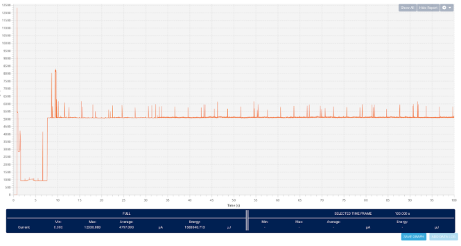

#
# Table of Contents

[1.	Openthread	5](#_toc192549516)

[2.	Why OpenThread	5](#_toc192549517)

[3.	Where Is OpenThread Used?	6](#_toc192549518)

[4.	Network Components & Roles	7](#_toc192549519)

[4.1.	OpenThread Border Router (OTBR)	7](#_toc192549520)

[4.2.	Thread Network Devices	7](#_toc192549521)

[5.	Tools	9](#_toc192549522)

[5.1.	Nordic’s NRF Zephyr SDK	9](#_toc192549523)

[5.2.	nRF Connect for Desktop	9](#_toc192549524)

[5.3.	STM32CubeIDE	9](#_toc192549525)

[6.	OpenThread Border Router Setup	10](#_toc192549526)

[7.	Key Features of OpenThread CLI Firmware	12](#_toc192549527)

[8.	Firmware	13](#_toc192549528)

[8.1.	nRF52840’s Radio Co-Processor (RCP) Firmware	13](#_toc192549529)

[8.2.	nRF5340DK’s (Leader) Thread: CLI Firmware	13](#_toc192549530)

[8.2.1.	Overview	14](#_toc192549531)

[8.2.2.	Zephyr Shell Interface	15](#_toc192549532)

[8.2.3.	UDP Data Transmission	15](#_toc192549533)

[8.2.4.	Thread Management	16](#_toc192549534)

[8.2.5.	Key Features	17](#_toc192549535)

[9.	nRF7002DK’s (Child) Thread: CLI Firmware	17](#_toc192549536)

[10.	Power Measurements	18](#_toc192549537)

[10.1.	nRF5340DK (Transmits UDP Packets)	18](#_toc192549538)

[10.2.	nRF7002DK (Receives UDP Packets)	20](#_toc192549539)

#

1. # Openthread

OpenThread is an open-source implementation of the Thread networking protocol, designed for low-power, wireless mesh networks. This document outlines the high-level topology of a Thread network using an OpenThread Border Router (OTBR) setup on a Linux laptop with various development boards.

Thread itself is based on IEEE 802.15.4, the same low-power wireless standard used by Zigbee. However, instead of relying on proprietary communication methods, Thread uses IPv6, making it easier to integrate with the internet and existing networks. OpenThread brings these benefits in a lightweight, flexible package that can run on a variety of microcontrollers and wireless chips.

1. ## Why OpenThread

At its core, Thread is based on IEEE 802.15.4, the same wireless standard used by Zigbee and other low-power networks. However, what sets Thread apart is its use of IPv6, thanks to 6LoWPAN (IPv6 over Low-Power Wireless Personal Area Networks).	

This approach offers several key benefits:	

Seamless Internet Integration: Unlike Zigbee, which requires translation to work with IP-based networks, OpenThread devices can communicate natively using IPv6, making integration with cloud services and internet-connected devices much simpler.

No Proprietary Gateways: Many IoT protocols, like Z-Wave and Zigbee, require a dedicated hub to translate their protocols into IP-based communication. OpenThread eliminates this dependency by allowing direct IP-based connectivity via a Thread Border Router.

Flexible Network Topology: OpenThread enables self-healing mesh networks, where devices can relay data between each other, extending coverage without needing a central hub. If one device fails, the network dynamically reroutes traffic through other nodes, improving reliability.

Low Power & Efficiency: Designed with energy efficiency in mind, OpenThread allows battery-powered devices like sensors, smart locks, and remote monitoring systems to operate for years on minimal power.

Open-Source & Multi-Vendor Support: OpenThread is not tied to a single manufacturer, which encourages broader industry adoption and interoperability between devices from different brands. Major semiconductor companies like Nordic Semiconductor, Silicon Labs, NXP, and Texas Instruments support OpenThread, offering hardware solutions optimized for Thread networks.

1. ## Where Is OpenThread Used?

With its open-source nature, native IPv6 support, and strong industry backing, OpenThread is positioned as one of the most future-proof and flexible solutions for IoT networking. Its integration into Matter, the universal smart home standard, further solidifies its role as a key technology for next generation connected devices.

1. ## Network Components & Roles

The network consists of the following components:

1. ## OpenThread Border Router (OTBR)
- Device: Linux Laptop running OTBR in Docker
- Function: Acts as a gateway between the Thread network and external IP-based networks (Wi-Fi, Ethernet, Internet)
- Thread Connection: Uses an nRF52840 Dongle as a Radio Co-Processor (RCP) for Thread communication

1. ## Thread Network Devices

- nRF52840 Dongle (RCP)
  - Role: Radio interface for OTBR
  - Function: Provides Thread connectivity for the OTBR but does not participate in routing
- nRF5340 DK (Thread Leader/Router)
  - Role: Thread Leader and Router
  - Function: Manages the network structure and forwards packets between Thread devices
- nRF7002 DK (End device in the Mesh Network)
  - Role: Router or optional secondary Border Router
  - Function: Extends network coverage and forwards messages within the Thread mesh

- STM32WB55RG (End device in the Mesh Network)
- ` `Router or End Device
- Function: Connects to the Thread mesh, may relay messages if acting as a Router.

*Documents/Images/figure *1*. High level architecture*

1. # Tools

1. ## Nordic’s NRF Zephyr SDK

Nordic’s Zephyr SDK is a library of drivers and configuration files that are developed on top of the vanilla Zephyr SDK. On top of that they have developed an extension for the Visual Studio Code, which offers visual representation of the hardware layer of each device, like any other IDE (e.g. STM32CubeIDE)

The development for the Nordic devices (nRF52840 Radio dongle, nRF7002DK and nRF5340DK) can be done in both Windows and Linux, since the Zephyr OS offers cross-compatibility.

1. ## nRF Connect for Desktop

This cross-platform application offers many tools that work well with the Nordic devices. The one we need is the **Programmer**, in order to flash the nRF52840 dongle with the correct firmware, since it doesn’t come with a dedicated hardware debugger, so it can’t be flashed via the VSCode extension. But, the firmware will be build with the VSCode extension.

1. ## STM32CubeIDE

The STM32CubeIDE will be used to develop the applications for the STM32WB boards. In this context, to note that if a firmware for the STM32 board(s) is developed, it may not use an RTOS and the application be a baremetal one. This should not be a problem since what we care about is the connection between the board and the OpenThread Border Router, and ST seems to have a well-developed solution for us to use as a guide.

1. # OpenThread Border Router Setup

**Overview**

To set up an OpenThread network, a host machine such as a Raspberry Pi or another Linux-based system is required to run the OpenThread Border Router (OTBR) application. The OTBR acts as a gateway between a Thread network and other networks, such as Wi-Fi or Ethernet, enabling seamless communication between Thread devices and external networks, including the internet. By establishing this bridge, OTBR ensures that devices in a Thread network can interact with cloud-based services, remote systems, or other local networked devices.

**Features of OTBR**

**Thread to IP Bridging**

The OTBR connects a Thread network to a wider IP network, such as Wi-Fi or Ethernet, allowing communication between Thread and non-Thread devices. This enables seamless data exchange between IoT devices operating on the Thread protocol and conventional internet-based systems, providing enhanced interoperability for smart home, industrial, and automation applications.

**Border Agent & Thread Commissioning**

It facilitates the secure onboarding of new Thread devices into the network. Using commissioning methods such as Bluetooth LE or external Joiners, new devices can be authenticated and integrated without compromising the security of the existing network. This ensures that only authorized devices are permitted to join, reducing the risk of unauthorized access or network breaches.

**Routing & Connectivity**

The OTBR functions as a full Thread router, managing the network’s routing operations to ensure reliable communication between Thread devices. It can dynamically take on the role of a Leader or Router within the Thread network, helping to maintain efficient routing paths and ensuring continuous network availability. By acting as a central communication hub, it improves resilience and redundancy within the Thread ecosystem.

**DNS-Based Service Discovery**

Local service discovery for Thread devices is provided through mDNS (Multicast DNS) and SRP (Service Registration Protocol). These protocols enable devices to discover and communicate with services within the same network without requiring centralized configuration. This simplifies the setup of IoT applications by allowing automatic detection of available devices and services, enhancing usability and scalability.

**Integration with IoT Protocols**

The OTBR supports IoT communication through various widely used protocols, including MQTT, Matter, and CoAP. These protocols facilitate seamless communication with cloud services, mobile applications, and other networked devices. MQTT provides a lightweight messaging protocol ideal for real-time applications, Matter ensures interoperability across different smart home ecosystems, and CoAP offers efficient resource-constrained communication, making OTBR a flexible solution for diverse IoT deployments.

1. # Key Features of OpenThread CLI Firmware

**Thread Network Control**

The OpenThread CLI firmware allows users to create and manage a Thread network through a set of commands. Users can initialize a Thread network by committing a dataset as active, enabling the network interface, and starting the Thread stack. Joining an existing Thread network is simplified using the joiner start command. Additionally, network settings such as PAN ID, channel, and network key can be configured, ensuring optimized network performance and security.

**Communication & Addressing**

Devices running OpenThread CLI firmware can send and receive UDP packets, enabling direct communication between nodes. This is achieved through commands such as udp open and udp send, which facilitate the transmission of messages within the network. IPv6 address management is also available, allowing users to assign, view, and configure addresses using the ipaddr command. This ensures proper addressing and connectivity across the Thread network.

**Device Roles**

OpenThread CLI firmware supports different device roles, allowing nodes to operate as Full Thread Devices (FTD) or Minimal Thread Devices (MTD). Depending on the network topology and requirements, devices can be configured as a Leader, Router, or End Device. Leaders and Routers help maintain and manage the network structure, while End Devices communicate with routers to transmit and receive data efficiently.

**Security & Keys**

Security is a crucial aspect of OpenThread networks, and the CLI firmware provides robust mechanisms for managing network security settings. Users can configure Pre-Shared Keys for Commissioning (PSKc) to securely authenticate devices joining the network. Other security credentials, including network keys and access control settings, can also be managed to ensure a secure and reliable communication environment.

**Energy & Radio Testing**

For optimization and testing purposes, the OpenThread CLI firmware provides tools for measuring power consumption and controlling the device’s radio functions. The power command enables users to monitor energy usage, which is essential for battery-powered IoT applications. Additionally, radio transmission and reception can be tested using commands like mac send, allowing users to verify network performance, signal strength, and connectivity across nodes.

1. # Firmware

1. ## nRF52840’s Radio Co-Processor (RCP) Firmware
To set up the OpenThread Border Router, the nRF52840 radio dongle must be programmed with the appropriate firmware. The nRF52840 System-on-Chip (SoC) inside the dongle serves as a radio interface for IEEE 802.15.4 (OpenThread) communication. This dongle connects to a host machine, such as a Raspberry Pi or other Linux-based system, via USB. The firmware used for this setup is known as a Coprocessor firmware, designed to work alongside a host system that manages higher-level Thread networking tasks. While the nRF52840 itself is responsible for low-level radio communication, the host system handles advanced processing tasks like routing and IPv6 management.

The RCP firmware, which is the one used in this setup, allows the nRF52840 to function purely as a radio device. Instead of running a full Thread stack, the nRF52840 operates only at the IEEE 802.15.4 MAC layer. The host system, such as a Raspberry Pi running OpenThread Border Router, takes full control of Thread networking operations. Communication between the host and the RCP firmware occurs via SPI, UART, or USB. This architecture is particularly useful in low-power border router implementations, where the host manages all higher-level networking.

1. ## nRF5340DK’s (Leader) Thread: CLI Firmware 
The nRF5340DK serves as the Thread Leader, responsible for managing the network, maintaining routing tables, and facilitating communication between devices. It runs the OpenThread Command Line Interface (CLI) firmware, which allows direct interaction with the network. Through this interface, you can form and manage the Thread network, monitor connected devices, send messages, and configure security settings. As the Leader, the nRF5340DK ensures stable network operation, assigns addresses, and maintains connectivity across the Thread mesh.

The leader’s firmware is designed to execute multiple computational workloads while supporting remote command control via UDP and a command-line shell interface.

1. ### Overview
The firmware operates as a multi-threaded system, managing independent computational tasks. It provides mechanisms to enable or disable these tasks dynamically through UDP commands or a shell interface. The system's core functionalities include:

- Floating-point arithmetic operations
  - The floating-point computation task performs arithmetic operations on large datasets, providing periodic progress updates. This task can be dynamically enabled or disabled.

- Integer-based computational tasks
  - The integer computation task executes intensive calculations on integer data and provides accumulated results at specified intervals. The task can be controlled via UDP commands or the shell interface.	
- Fibonacci sequence computation
  - The Fibonacci computation task calculates the 500th Fibonacci number in a loop, simulating CPU-intensive workloads. It periodically outputs progress updates to allow performance monitoring.	
- UDP-based command reception and processing
  - The system listens for external UDP commands to enable or disable computation tasks remotely. This feature facilitates flexible remote operation and control over system behavior.

- Interactive shell-based system control	
- Periodic UDP data transmission

1. ### Zephyr Shell Interface
An interactive command-line interface is implemented using Zephyr’s shell framework. Users can enable or disable tasks and query the system’s status using predefined commands such as:

- “command enable\_float”
- “command enable\_int”
- “command enable\_fibonacci’
- “command status”

1. ### UDP Data Transmission
The UDP packet transmitted by the nRF5340DK’s Thread firmware consists of a UDP header and a payload. The payload contains six randomly generated numbers, formatted as a comma-separated string. This packet is periodically transmitted, providing external systems with system-generated data for further processing. The packet structure ensures efficient and reliable data transfer within the Thread network, with the payload being the key data for communication between devices.

*Figure *2*. Transmission packet explained*

*Figure *3*. UDP header and Payload packet structure*
1. ### Thread Management
The firmware employs Zephyr’s kernel threading model, with dedicated stack allocations for each computational workload. The active threads and their respective parameters are summarized below:

*Figure *4*. Shell Commands*

Each thread remains in an idle state when its respective computation is disabled, thereby optimizing CPU utilization.

1. ### Key Features
- **Event-Driven Execution:** Threads operate only when explicitly enabled, conserving system resources.
- **Non-Blocking Architecture**: The system uses `k\_yield()` to facilitate cooperative multitasking and prevent CPU starvation.
- **Scalability**: The modular design allows for easy integration of additional computational tasks and communication protocols.
- **Real-Time Monitoring**: Logs progress updates and system status, ensuring visibility into computational workloads.

1. ## nRF7002DK’s (Child) Thread: CLI Firmware

The firmware on the nRF7002DK is identical to that of the nRF5340DK, but with the key difference that it acts as a Thread Child device. While the nRF5340DK (Leader) manages the Thread network and sends out data, the nRF7002DK (Child) receives data from the Leader over the network. It processes the received data and executes tasks as instructed by the Leader.

Like the Leader, the Child device supports the same computational tasks and UDP-based communication, but it only responds to commands from the Leader and does not manage the Thread network itself.

1. ## Power Measurements

In the following sections, energy consumptions measurements are displayed and analysed.

1. ### nRF5340DK (Transmits UDP Packets)

As shown in Figure 5, a single UDP transmission in the OpenThread network consumes 192.403 μJ over a transmission period of 0.011 seconds. This minimal energy consumption makes the transmission process highly efficient from an energy perspective.

*Figure *5*. nRF5340DK Energy Consumption*

*Figure *6*. UDP Tx Energy Consumption Acquisition Graph*

And the overall energy consumption acquisition graph of the nRF5340DK application, in the role of the Leader in the OpenThread network, executing an integer calculation and transmitting UDP packets in 3-second intervals, is shown in Figure 7 below.

*Figure *7*. Complete Application Energy Consumption Acquisition Graph of the nRF5340DK*
1. ### nRF7002DK (Receives UDP Packets)

Similarly, the reception of a UDP packet consumes 443.035 μJ over a transmission period of 0.024 seconds, which is slightly higher than the transmission energy but remains highly efficient for IoT applications.

*Figure *8*. nRF7002DK Energy Consumption*

*Figure *9*. UDP Rx Energy Consumption Acquisition Graph*

And the overall energy consumption acquisition graph of the nRF7002DK application, in the role of the Child in the OpenThread network, executing the UDP 3-second intervals reception (transmission happens as shown in Figure 7 from the nRF5340DK board), is shown in Figure 10 below.

*Figure *10*. Complete Application Energy Consumption Acquisition Graph of the nRF7002DK*

